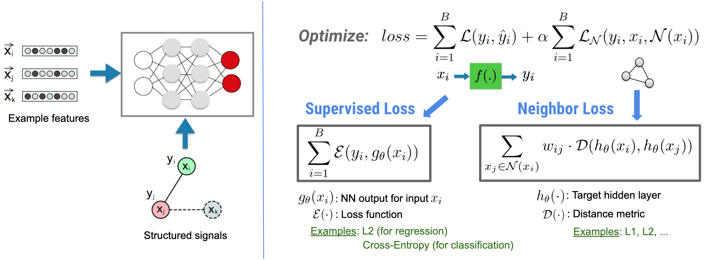
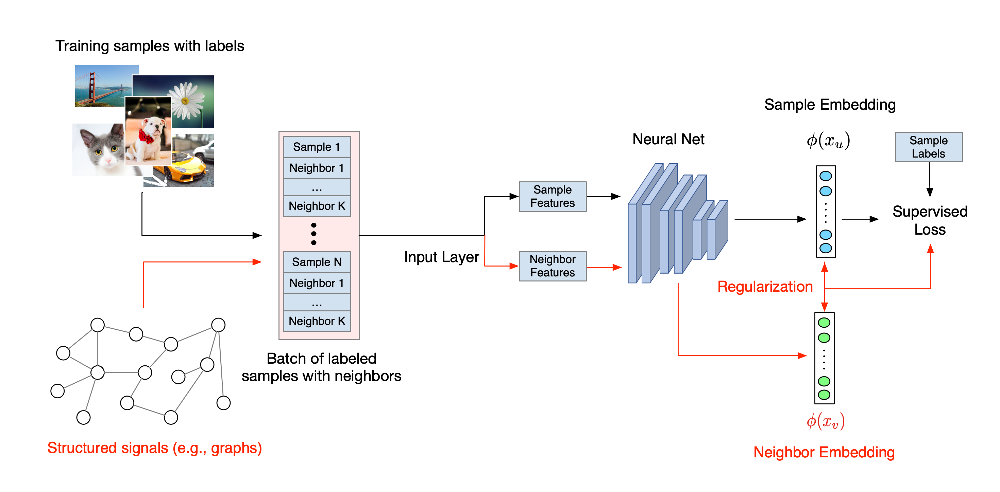

## The Neural Structured Learning Framework

Neural Structured Learning (NSL) focuses on training deep neural networks by
leveraging structured signals (when available) along with feature inputs. As
introduced by
[Bui et al. (WSDM'18)](https://ai.google/research/pubs/pub46568.pdf), these
structured signals are used to regularize the training of a neural network,
forcing the model to learn accurate predictions (by minimizing supervised loss),
while at the same time maintaining the input structural similarity (by
minimizing the neighbor loss, see the figure below). This technique is generic
and can be applied on arbitrary neural architectures (such as Feed-forward NNs,
Convolutional NNs and Recurrent NNs).

Note that the generalized neighbor loss equation is flexible and can have other
forms besides the one illustrated above. For example, we can also select

 to be the
neighbor loss, which calculates the distance between the ground truth

and the prediction from the neighbor .
 This is commonly used
in adversarial learning
[(Goodfellow et al., ICLR'15)](https://arxiv.org/pdf/1412.6572.pdf). Therefore,
NSL generalizes to **Neural Graph Learning** if neighbors are explicitly
represented by a graph, and to **Adversarial Learning** if neighbors are
implicitly induced by adversarial perturbation.

The overall workflow for Neural Structured Learning is illustrated below. Black
arrows represent the conventional training workflow and red arrows represent the
new workflow as introduced by NSL to leverage structured signals. First, the
training samples are augmented to include structured signals. When structured
signals are not explicitly provided, they can be either constructed or induced
(the latter applies to adversarial learning). Next, the augmented training
samples (including both original samples and their corresponding neighbors) are
fed to the neural network for calculating their embeddings. The distance between
a sample's embedding and its neighbor's embedding is calculated and used as the
neighbor loss, which is treated as a regularization term and added to the final
loss. For explicit neighbor-based regularization, we typically compute the
neighbor loss as the distance between the sample's embedding and the neighbor's
embedding. However, any layer of the neural network may be used to compute the
neighbor loss. On the other hand, for induced neighbor-based regularization
(adversarial), we compute the neighbor loss as the distance between the output
prediction of the induced adversarial neighbor and the ground truth label.

## Why use NSL?

NSL brings the following advantages:

*   **Higher accuracy**: the structured signal(s) among samples can provide
    information that is not always available in feature inputs; therefore, the
    joint training approach (with both structured signals and features) has been
    shown to outperform many existing methods (that rely on training with
    features only) on a wide range of tasks, such as document classification and
    semantic intent classification
    ([Bui et al., WSDM'18](https://ai.google/research/pubs/pub46568.pdf) &
    [Kipf et al., ICLR'17](https://arxiv.org/pdf/1609.02907.pdf)).
*   **Robustness**: models trained with adversarial examples have been shown to
    be robust against adversarial perturbations designed for misleading a
    model's prediction or classification
    ([Goodfellow et al., ICLR'15](https://arxiv.org/pdf/1412.6572.pdf) &
    [Miyato et al., ICLR'16](https://arxiv.org/pdf/1704.03976.pdf)). When the
    number of training samples is small, training with
    adversarial examples also helps improve model accuracy
    ([Tsipras et al., ICLR'19](https://arxiv.org/pdf/1805.12152.pdf)).
*   **Less labeled data required**: NSL enables neural networks to harness both
    labeled and unlabeled data, which extends the learning paradigm to
    [semi-supervised learning](https://en.wikipedia.org/wiki/Semi-supervised_learning).
    Specifically, NSL allows the network to train using labeled data as in the
    supervised setting, and at the same time drives the network to learn similar
    hidden representations for the "neighboring samples" that may or may not
    have labels. This technique has shown great promise for improving model
    accuracy when the amount of labeled data is relatively small
    ([Bui et al., WSDM'18](https://ai.google/research/pubs/pub46568.pdf) &
    [Miyato et al., ICLR'16](https://arxiv.org/pdf/1704.03976.pdf)).

## Step-by-step Tutorials

To obtain hands-on experience with Neural Structured Learning, we have three
tutorials that cover various scenarios where structured signals may be
explicitly given, induced or constructed:

*   [Graph regularization for document classification using natural graphs](graph_keras_mlp_cora.ipynb).
    In this tutorial, we explore the use of graph regularization to classify
    documents that form a natural (organic) graph.

*   [Graph regularization for sentiment classification using synthesized graphs](graph_keras_lstm_imdb.ipynb).
    In this tutorial, we demonstrate the use of graph regularization to classify
    movie review sentiments by constructing (synthesizing) structured signals.

*   [Adversarial learning for image classification](adversarial_keras_cnn_mnist.ipynb).
    In this tutorial, we explore the use of adversarial learning (where
    structured signals are induced) to classify images containing numeric
    digits.
