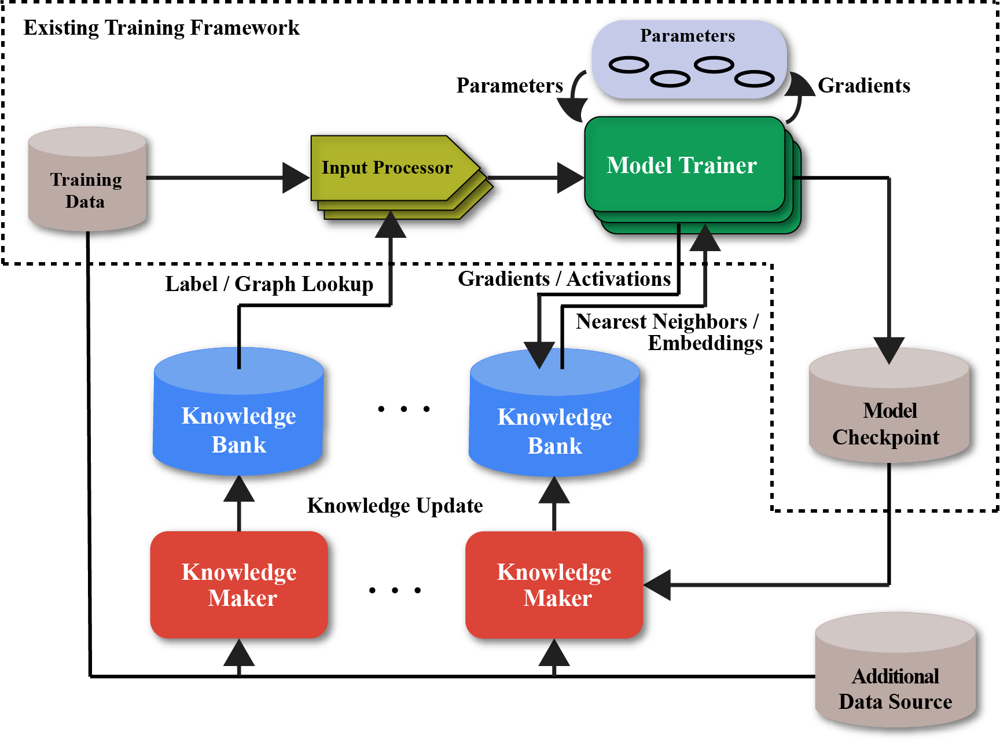
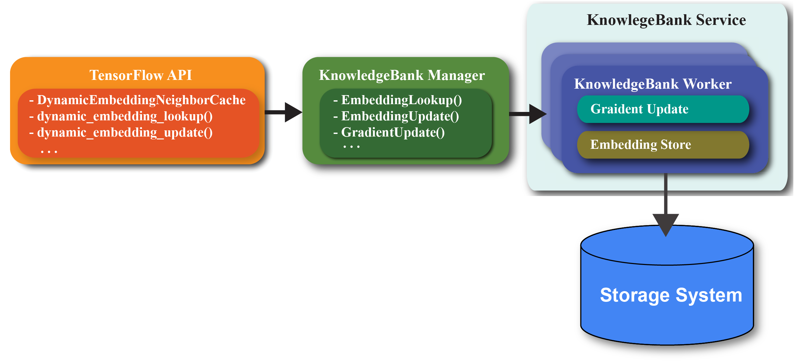

# CARLS: Cross-platform Asynchronous Representation Learning System

## System Overview

<p align="center">

<figcaption>Figure 1: CARLS employs three major components: Model Trainer, Knowledge Maker and Knowledge Bank. Models Trainers are the main jobs training and updating model parameters, and Knowledge Makers are running in parallel to compute auxiliary information required for gradient calculation and store the information in Knowledge Bank. Note that these components can be deployed on different platforms (GPUs, TPUs, etc) and communicatewith each other in an asynchronous fashion.</figcaption>
</p>

### Components

<p align="center">

</p>

*   TensorFlow APIs: a set of customized ops that enable the communications
    among different components of our systems.

*   Knowledge Bank: a set of servers that are responsible for processing/storing
    the data generated by different components.

    *   KnowledgeBank Service (KBS): a gRPC server that implements embedding
        lookup/update.
    *   KnowledgeBank Manager (KBM): client side C++ hub that talks to KBS.
    *   Storage System: underlying storage for Knowledge Bank, e.g.,
        InProtoKnowledgeBank for in-memory storage.

## An End-to-End Example

Below are the intructions to run the example under
[examples/graph_keras_mlp_cora.py](examples/graph_keras_mlp_cora.py) by building
from source.

### Prerequisite

*   Create a virtual environment (optional) and install TensorFlow by following
    the
    [instructions](https://www.tensorflow.org/install/pip#2.-create-a-virtual-environment-recommended).

*   Follow the instructions from
    [tensorflow.org](https://www.tensorflow.org/install/source#install_bazel) to
    install Bazel.

*   Install additional packages

    ```sh
    $ pip3 install -r neural_structured_learning/requirements.txt
    ```

*   Install neural-structured-learning

    ```sh
    $ pip3 install neural-structured-learning
    ```

### Step One: Download the Neural Structured Leaning source code.

```sh
$ git clone https://github.com/tensorflow/neural-structured-learning.git
$ cd neural-structured-learning
```

### Step Two: Download the data to /tmp/cora.

```sh
$ bash neural_structured_learning/examples/preprocess/cora/prep_data.sh
```

### Step Three: Run the example

```sh
$ bazel run research/carls/examples/graph_regularization:graph_keras_mlp_cora -- \
/tmp/cora/train_merged_examples.tfr /tmp/cora/test_examples.tfr \
--alsologtostderr --output_dir=/tmp/carls
```
