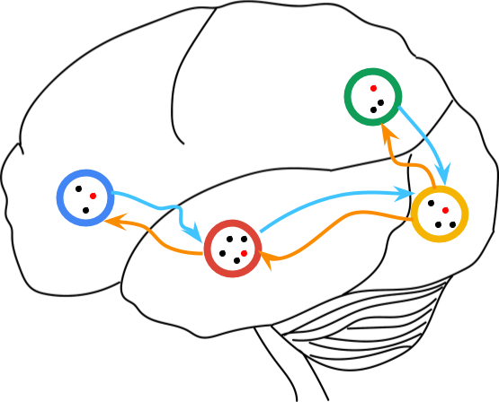

# Dynamic Memory

<figcaption>Dynamic memory assumes the activations of a hidden layer in a neural
  network can form clusters, where the cluster number may change dynamically
  as more data are seen.
</figcaption>

Dynamic Memory expands the scope of dynamic embedding in CARLS to handle
continous signals among the hidden layers of a deep neural network.

## Why Dynamic Memory?

*   Conscious Machine Learning: allows any DNN model to say "I cannot recognize
    this sample" on out of distribution (OOD) input. It provides a principled
    solution to out of distribution detection, model fairness, model stability,
    interpretable AI, etc.

*   Better Batch Normalization: a new theoretical reformulation of Batch
    Normalization, leading to a new Dynamic Normalization layer with improved
    performance.
