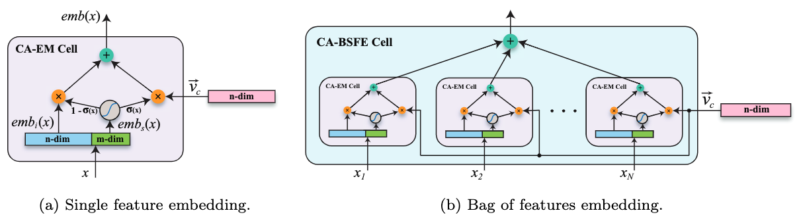

# CARLS models for Context Aware Machine Learning (CAML)

CAML is a general framework for building deep learning models
([arxiv](https://arxiv.org/abs/1901.03415)). Compared to traditional DNN models,
it adds an additional context-free/sensitive-ness component to help decide the
confidence/quality of input/output during inference.

## Sparse Features (sparse_features.py)

<figcaption>Fig. 1 The architecture for single feature embedding (CA-EM) and multiple
  feature embedding(CA-BSFE). Here $\sigma$ denotes the logistic probability
  of the context free embeddings of the sparse feature $x$.
</figcaption>

### Single Feature Embedding (CA-EM model)

A sparse feature is simply a (feature_name, feature values) pair that can be
represented in tensorflow.Example proto. Assume that the sparse feature $$x$$
can be mapped to two embedding spaces $$emb_i(x) \in R^n$$, representing the
context sensitive embeddings ,and $$emb_s(x) \in R^m$$, representing the context
free embeddings, the CAML theory states that the sparse feature $$x$$ can be
represented as a weighted sum:

$$emb(x) = \sigma(x) v_c + (1 - \sigma(x)) emb_i(x)$$

where $$v_c$$ is a global vector representing the common components shared among
all the instances, $$\sigma(x) = sigmoid(\theta^T * emb_s(x))$$ is the logistic
probability of the context free embeddings of the sparse feature $$x$$.

This library also supports sparse feature embedding by directly averaging using
dynamice embedding (simply set sigma_dimension = 0). This way all sparse
features can be embedded.

### Bag-of-Sparse-Features Embedding (CA-BSFE model)

Based on Eq. 20 of [[Zeng. et. al](https://arxiv.org/abs/1901.03415)], a single
embedding can be computed for a set of sparse features $$X$$ as follows:

$$emb(X) = v_c \sum_{x\in X} \sigma(x) + \sum_{x \in X} (1 - \sigma(x)) emb_i(x)$$

### Dictionary of Bag-of-Sparse-Features Embedding

When there are multiple feature categories represented by pairs of
(feature_name, bag of feature values) (e.g., for a website, we might have
knowledge graph entities, images, sentences with variable sizes), a single
embedding can be computed by a concatenation of these bag of feature embeddings.
