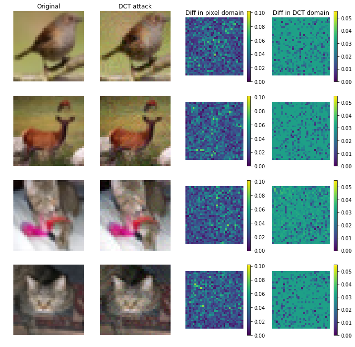

# Adversarial Robustness Across Representation Spaces

Adversarial robustness corresponds to the susceptibility of deep neural networks
to imperceptible perturbations made at test time. In the context of
image-related tasks, many algorithms have been proposed to make neural networks
robust to adversarial perturbations made to the input pixels. These
perturbations are typically measured in an *L_p* norm. However, robustness often
holds only for the specific attack used for training. In this work we extend the
above setting to consider the problem of training of deep neural networks that
can be made simultaneously robust against perturbations applied in multiple
natural representation spaces. For image data, examples include the standard
pixel representation as well as the representation in the discrete cosine
transform (DCT) basis. We design a theoretically-sound algorithm with formal
guarantees for the above problem. Furthermore, the guarantees also hold when the
goal is to require robustness with respect to multiple *L_p* norm based attacks.
We then derive an efficient and practical implementation and demonstrate the
effectiveness of our approach on standard datasets for image classification.

Example CIFAR-10 images with their adversarially perturbed counterparts computed
by launching a PGD-based attack in the DCT basis. The perturbed images, although
imperceptible, is far from the original images in the pixel basis in
*L_infinity* norm.



## How to run

First install required packages.

```bash
$ pip install -r requirements.txt
```

To train a model, supply 3 config files: One for the dataset, one for the
adversaries, and one for the training algorithm. The following example uses the
MNIST data set and the multiplicative-weight algorithm (`multiweight`). See
other files in the `confgs` directory for other choices.

```bash
$ python -m multi_representation_adversary.main \
    --gin_configs=configs/mnist_base.gin \
    --gin_configs=configs/mnist_adversary_train.gin \
    --gin_configs=configs/exp02_multiweight.gin \
    --summary_dir=./summary-train \
    --ckpt_dir=./ckpt \
    --run_train
```

To evaluate a trained model, swap the adversary config to the one for evaluation
(since the hyperparameters are often different in training and in evaluation).

```bash
$ python -m multi_representation_adversary.main \
    --gin_configs=configs/mnist_base.gin \
    --gin_configs=configs/mnist_adversary_eval.gin \
    --gin_configs=configs/exp02_multiweight.gin \
    --summary_dir=./summary-eval \
    --ckpt_dir=./ckpt \
    --run_eval
```

Note: To use the Tiny ImageNet dataset, one has to prepare the dataset in
TensorFlow Dataset format.

## Citation

If you use the code, please consider citing the following paper [1]:

```
@misc{awasthi2020adversarial,
      title={Adversarial Robustness Across Representation Spaces},
      author={Pranjal Awasthi and George Yu and Chun-Sung Ferng and Andrew Tomkins and Da-Cheng Juan},
      year={2020},
      eprint={2012.00802},
      archivePrefix={arXiv},
      primaryClass={cs.CV}
}
```

## Reference

[[1] Awasthi, P., Yu, G., Ferng, C. S., Tomkins, A., & Juan, D. C. (2020).
Adversarial Robustness Across Representation Spaces. arXiv preprints
arXiv:2012.00802.](https://arxiv.org/abs/2012.00802)
