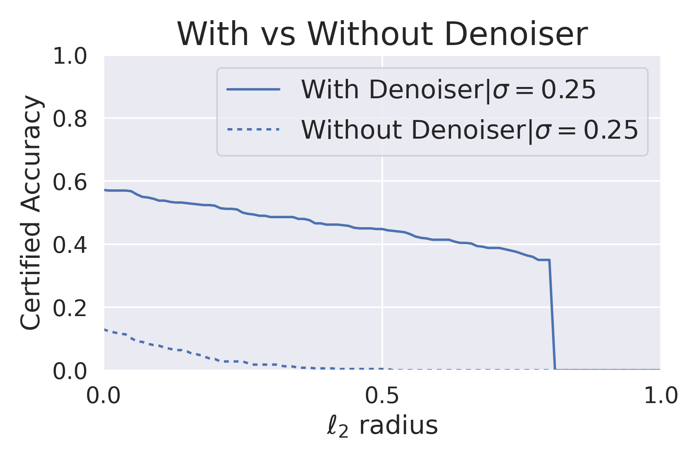

# Denoised-Smoothing-TF
Minimal implementation of [Denoised Smoothing: A Provable Defense for Pretrained Classifiers](https://arxiv.org/abs/2003.01908) in TensorFlow. 

**Denoised Smoothing** is a simple and elegant way to (provably) robustify pre-trained image classification models (including the cloud APIs with only query access) and _l2_ adversarial attacks. [This blog post](https://www.microsoft.com/en-us/research/blog/denoised-smoothing-provably-defending-pretrained-classifiers-against-adversarial-examples/) provides a nice introduction to the method. The figure below summarizes what Denoised Smoothing is and how it works:

<div align="center">
</img><br>
<small><a href="https://www.microsoft.com/en-us/research/blog/denoised-smoothing-provably-defending-pretrained-classifiers-against-adversarial-examples/">Source</a></small>
</div><br>

* Take a pre-trained classifier and prepend a pre-trained denoiser with it. Of course, the dataset on which the classifier and the denoiser would need to be trained on the same/similar dataset. 
* Apply [Randomized Smoothing](https://arxiv.org/abs/1902.02918). 

Randomized Smoothing is a well-tested method to provably defend against _l2_ adversarial attacks under a specific radii. But it assumes that a classifier performs well under Gaussian noisy perturbations which may not always be the case.  

**Note**: Many scripts have been utilized from the [official repository](https://github.com/microsoft/denoised-smoothing) of Denoised Smoothing to develop this. 

## Further notes

* The Denoised Smoothing process is demonstrated on the CIFAR-10 dataset. 
* You can train a classifier quickly with the [`Train_Classifier.ipynb`](https://colab.research.google.com/github/sayakpaul/neural-structured-learning/blob/master/research/denoised_smoothing/notebooks/Train_Classifier.ipynb) notebook.
* Training of the denoiser is demonstrated in the [`Train_Denoiser.ipynb`](https://colab.research.google.com/github/sayakpaul/neural-structured-learning/blob/master/research/denoised_smoothing/notebooks/Train_Denoiser.ipynb) notebook. 
* Certification tests are in [`Certification_Test.ipynb`](https://colab.research.google.com/github/sayakpaul/neural-structured-learning/blob/master/research/denoised_smoothing/notebooks/Certification_Test.ipynb) notebook. 

All the notebooks can be executed on Colab! You also have the option to train using the free TPUs.

## Results

| Denoiser with stability objective | Denoiser with MSE objective |
| ---------|-------|
|     |  | 

As we can see prepending a pre-trained denoiser is extremely helpful for our purpose. 

## Models

The models are available inside [`models.tar.gz`](https://github.com/sayakpaul/Denoised-Smoothing-TF/blob/main/models.tar.gz) in `SavedModel` format. In the interest of reproducibility, the initial model weights are also provided. 

## Acknowledgements

* [Hadi Salman](https://hadisalman.com/) (first author of Denoised Smoothing) for fruitful discussions. 
* [ML-GDE program](https://developers.google.com/programs/experts/) for providing GCP credits. 

## Paper citation
```
@inproceedings{NEURIPS2020_f9fd2624,
 author = {Salman, Hadi and Sun, Mingjie and Yang, Greg and Kapoor, Ashish and Kolter, J. Zico},
 booktitle = {Advances in Neural Information Processing Systems},
 editor = {H. Larochelle and M. Ranzato and R. Hadsell and M. F. Balcan and H. Lin},
 pages = {21945--21957},
 publisher = {Curran Associates, Inc.},
 title = {Denoised Smoothing: A Provable Defense for Pretrained Classifiers},
 url = {https://proceedings.neurips.cc/paper/2020/file/f9fd2624beefbc7808e4e405d73f57ab-Paper.pdf},
 volume = {33},
 year = {2020}
}
```
